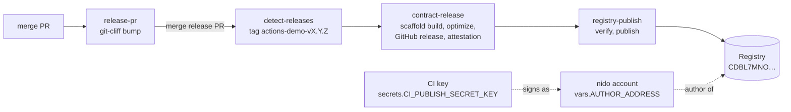
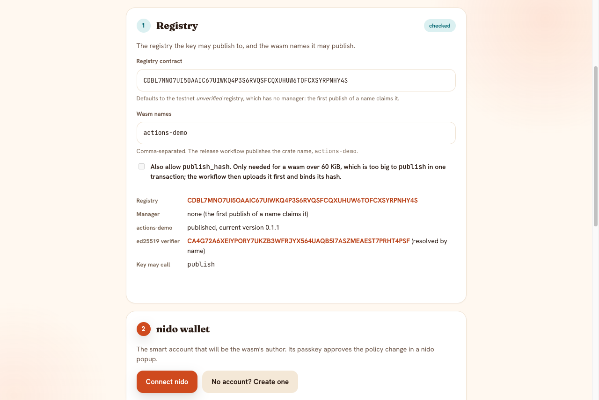
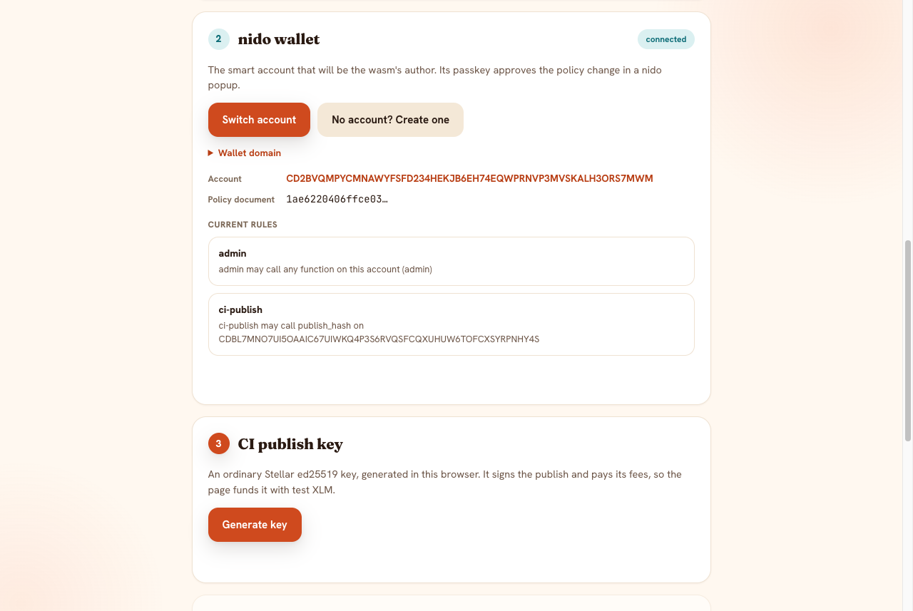
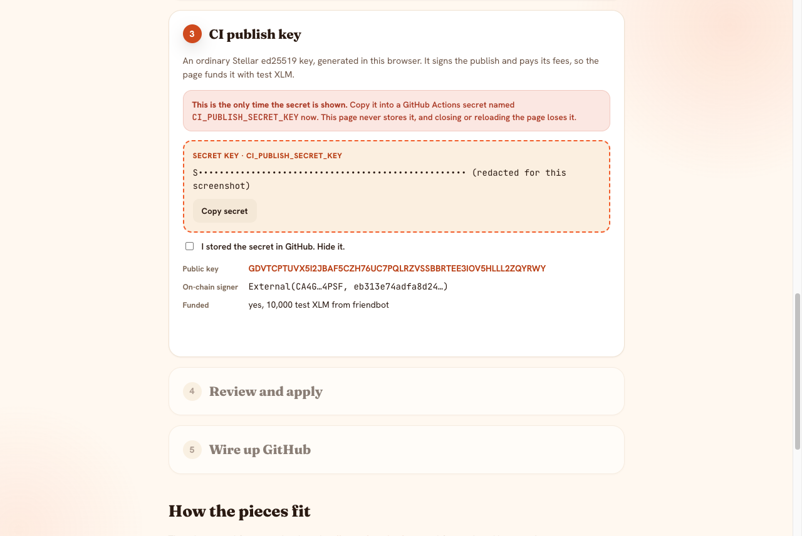
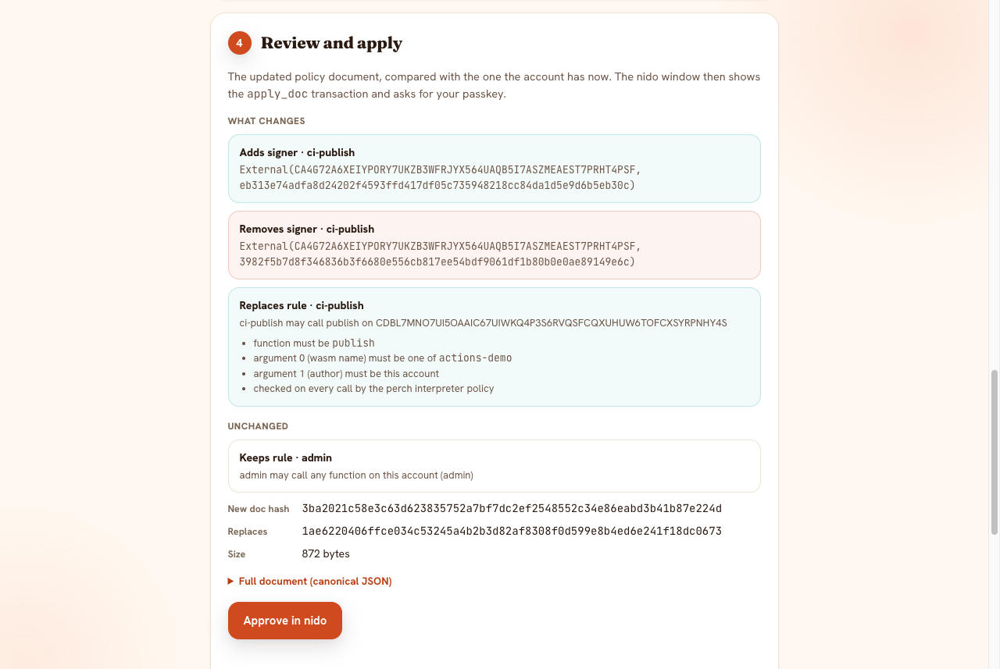
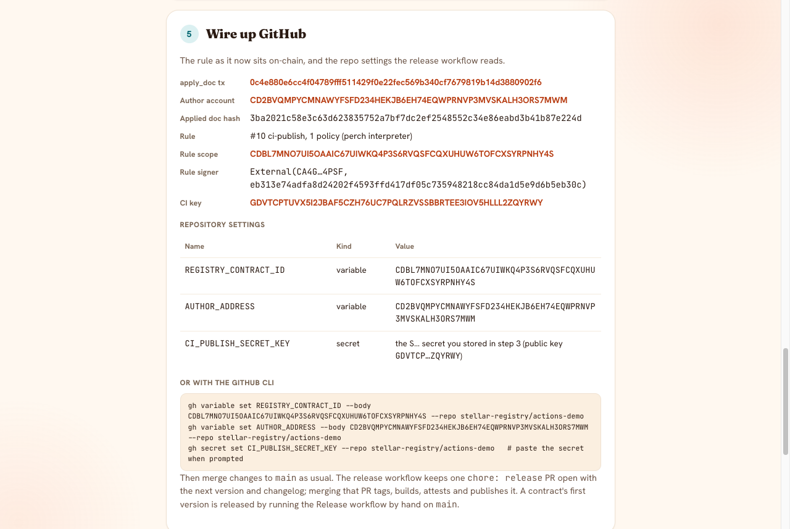

# actions-demo

A working demo of the Stellar Registry release pipeline from
[stellar-registry/actions](https://github.com/stellar-registry/actions), running
on testnet. Merged changes collect in one release PR; merging that PR tags,
builds, attests and publishes a Soroban contract to the Registry. The publish
is signed by a CI key that can call `publish` on one registry for one wasm
name and nothing else. You provision that key with a
[nido](https://nido.fyi) smart-account wallet from this repo's GitHub Pages
dapp:

**https://stellar-registry.github.io/actions-demo/**

The repo is the proof for the SCF public-goods milestone
[D11: Registry GH workflow to publish wasms and upgrade contracts](https://scf-public-goods-maintenance.github.io/projects/stellar-registry/#d11-registry-gh-workflow-to-publish-wasms-and-upgrade-contracts).

## What D11 asks for, and where it is met

| Milestone ask | How this repo meets it |
| --- | --- |
| Wrap the stellar-expert soroban build workflow | [`release.yml`](.github/workflows/release.yml) calls `contract-release.yml` from stellar-registry/actions, the registry's version of `stellar-expert/soroban-build-workflow`. It creates the GitHub release, submits the hash to stellar.expert contract validation and signs GitHub build provenance for the wasm. |
| Build with `stellar scaffold build` | `contract-release.yml` runs `stellar scaffold build --package actions-demo --meta source_repo=…` then `stellar contract optimize`. `cargo_inherit` in the crate manifest writes the version into the wasm as `binver` meta. |
| Publish new versions of already-published wasms to the Registry | `registry-publish.yml` verifies the attestation and `binver`, then publishes with one smart-account-signed `publish`. A wasm over 60 KiB is uploaded first and bound with `publish_hash` instead ([stellar-registry/actions#15](https://github.com/stellar-registry/actions/pull/15)). [Run 1](https://github.com/stellar-registry/actions-demo/actions/runs/36362820785) published `actions-demo` 0.1.0, which claimed the name. [Run 2](https://github.com/stellar-registry/actions-demo/actions/runs/36362983847) published 0.1.1 as a new version; both used the earlier upload + `publish_hash` path. [Run 3](https://github.com/stellar-registry/actions-demo/actions/runs/36366464508) published 0.1.2 with a single `publish`. |
| Research keys that can only invoke `publish`, can live in a GitHub workflow, and carry no risky privileges | The CI key is a signer on a nido smart account whose policy document scopes it to `publish` on one registry, for listed names, with the account itself as author. See [Security model](#security-model). The ML-DSA (post-quantum) variant is researched and proven on testnet, but the shared workflow can't sign it yet: [stellar-registry/actions#14](https://github.com/stellar-registry/actions/issues/14). |
| A documented repository, tested in production | This README and the [testnet evidence](#testnet-evidence) below. |
| Contract upgrades | Deferred by the milestone; out of scope here. |

## How it works



All four jobs are stellar-registry/actions reusable workflows, pinned by
commit the way [perch](https://github.com/stellar-registry/perch) pins them:
`7152f7c` for release-pr, detect-releases and contract-release. registry-publish
is pinned to `7076ce9`, the head of
[stellar-registry/actions#15](https://github.com/stellar-registry/actions/pull/15);
that pin moves to the merged commit before this repo's PR merges.

Publishing is a manual decision. Every push to `main` runs `release-pr`, which
keeps one `chore: release` PR open with the next version and changelog,
computed by git-cliff from the conventional commits under the contract's
crate. Several merged changes therefore go out together as one version. A
`release-gate` job lets `detect-releases` run only when the push is that
release PR (`release/next`) merging, which it checks through the GitHub API
that maps a commit to its pull request. Any other push publishes nothing, even
one that bumped a version by hand. The exception is a contract's first
version: with no tag yet, git-cliff has nothing to bump from and proposes no
release PR. You release it by running the Release workflow by hand on `main`
with no `publish_tag`.
The build and publish jobs hang off `detect-releases` with `needs:` in the same
run, because tags pushed with `GITHUB_TOKEN` don't start new workflow runs, so
no GitHub App is needed.

### What signs, and what pays

`registry-publish.yml` publishes a wasm that fits in one transaction with a
single **`registry.publish(name, author, wasm, version)`**. The registry
uploads the bytes itself and calls `author.require_auth()`; the author is the
nido smart account.
- **Signing.** The `theahaco/stellar-cli` fork the workflow installs finds the
  account's rule that lists the CI key. It signs the account's auth entry: an
  OZ `AuthPayload` with one `External(ed25519 verifier, public key)` signer
  over the rule-bound digest. That entry includes the wasm bytes, so the
  signature covers the code itself.
- **Checking.** The account's `__check_auth` verifies the signature through
  perch's ed25519 verifier (`CA4G72A6…`). The perch interpreter policy on the
  rule then checks the call.
- **Paying.** The CI key's own classic account is the transaction source and
  pays the fee.

The wasm travels twice in that transaction, as the argument and inside the
signed auth entry, and a Soroban transaction is capped at 132096 bytes. So a
wasm over `publish_max_wasm_bytes` (60 KiB) takes the fallback: a
`stellar contract upload` authorized by the transaction source alone, then
`publish_hash` signed the same way. The demo contract is about 1 KB.

So one ordinary Stellar key (`S…`/`G…`) does both jobs. It pays fees from its
own balance (testnet XLM from friendbot) and it signs for the smart account only
under the one rule that lists it.

The key is registered as `External(verifier, pubkey)` rather than
`Delegated(G…)`. nido pins upstream OZ `stellar-accounts`, whose `Delegated`
signer calls `require_auth_for_args` and needs a separate auth entry. The fork
signs `Delegated` signers as a CAP-71 `AddressWithDelegates` credential, which
only perch's patched OZ accepts. Tested on testnet: the `Delegated` form fails
with `Error(Auth, InvalidAction)`, and the `External` form publishes
([tx](https://stellar.expert/explorer/testnet/tx/04d09ec04eb9b32cd5b45b9978f20651ea94689758f8933ae66a2b3e1d8e4958)).

### The policy document

A nido account's policy is a [perch](https://github.com/stellar-registry/perch)
PolicyDoc, applied with `apply_doc`. The account cross-calls perch's
doc-compiler, replaces its whole rule set with the compiled rules, and stores
the canonical JSON and its hash on-chain. The dapp reads the applied document,
or nido's passkey-admin baseline on a first apply. It adds the key and one
rule, and hands the `apply_doc` transaction to the nido wallet, where the
passkey signs it. Here is the document now applied on testnet, key material
shortened (read it with `get_applied_doc`; its hash is `3ba2021c…`):

```json
{
  "version": 1,
  "network": "Test SDF Network ; September 2015",
  "signers": [
    { "id": "admin", "verifier": "CACVGSAHYFBXY4LJKWW5B57LAAXHCZVDZOANUTYPLNV6HHQI4Q35EGMY", "key": "04aef679…a68930" },
    { "id": "ci-publish", "verifier": "CA4G72A6XEIYPORY7UKZB3WFRJYX564UAQB5I7ASZMEAEST7PRHT4PSF", "key": "eb313e74…5eb30c" }
  ],
  "rules": [
    { "name": "admin", "scope": { "type": "self-admin" }, "principals": { "type": "all", "signers": ["admin"] } },
    {
      "name": "ci-publish",
      "scope": { "type": "contract", "address": "CDBL7MNO7UI5OAAIC67UIWKQ4P3S6RVQSFCQXUHUW6TOFCXSYRPNHY4S" },
      "principals": { "type": "all", "signers": ["ci-publish"] },
      "functions": ["publish"],
      "args": [
        { "index": 0, "pred": { "type": "string-in", "values": ["actions-demo"] } },
        { "index": 1, "pred": { "type": "is-self" } }
      ]
    }
  ]
}
```

`publish` is the only function the rule allows. The dapp adds `publish_hash`
only when you tick "Also allow publish_hash", which is needed only if one of
your wasms is over 60 KiB and goes through the upload fallback.

## Security model

**What the key can do.** Sign `publish` on the registry named in the rule, for
a wasm name in the allow-list, with the nido account as author. It can also
spend its own account's XLM on fees.

**What it can't do.** Each of these was checked on testnet by an
enforce-mode simulation signed by the live CI key. Run it yourself with
[`app/scripts/check-key-scope.mjs`](app/scripts/check-key-scope.mjs); nothing is
submitted:

```text
key GDVTCPTUVX5I2JBAF5CZH76UC7PQLRZVSSBBRTEE3IOV5HLLL2ZQYRWY holds rule #10 "ci-publish" on CD2BVQMPYCMNAWYFSFD234HEKJB6EH74EQWPRNVP3MVSKALH3ORS7MWM

publish, allowed name, author = account (expected: AUTHORIZED)
  -> AUTHORIZED
publish, another name
  -> refused: Error(Auth, InvalidAction)
publish_hash (authorized only if the rule opted in for wasms over 60 KiB)
  -> refused: Error(Auth, InvalidAction)
XLM transfer out of the account
  -> refused: Error(Auth, InvalidAction)
apply_doc (rewrite the account policy)
  -> refused: Error(Auth, InvalidAction)
```

- The rule's scope is one registry contract, so calls to any other contract
  have no rule for this key (OZ matches `CallContract` rules by target).
- The rule has no self-admin scope, so the key can't change the account's
  policy or signers.
- The key can't hand the name to another author. `preauthorize_author_transfer`
  is outside the rule's function list. (On this registry deployment that call
  fails in simulation with a storage error before auth is checked, so the
  scope check can't exercise it and doesn't list it.)
- `publish_hash` is refused: the rule doesn't opt in, and the demo's wasm is
  far below the 60 KiB fallback threshold.
- `publish` binds a name and version to code, and deploys nothing, so
  publishing grants no authority over existing contracts.

**If the secret leaks.** An attacker can publish a version of the listed names
with code you didn't build. The registry only accepts versions above the
current one, so they could also burn version numbers. That version appears
on-chain with no matching GitHub release or build attestation, which is how
consumers who check provenance tell it apart. Response: run the dapp again to
rotate. `apply_doc` replaces the whole document, so the old key's signer entry
is gone in the same transaction, and a rotated-out key has no rule to sign
under. This repo's key was rotated that way four times during the demo. To
revoke without a replacement, remove the `ci-publish` rule on nido's policy
page.

**Other assumptions.**
- GitHub Actions secret storage protects `CI_PUBLISH_SECRET_KEY`. The publish
  job only sees it as `STELLAR_ACCOUNT`/`STELLAR_SIGN_WITH_KEY`
  environment variables, never in argv.
- The reusable workflows are pinned by commit sha. `registry-publish.yml`
  installs the `theahaco/stellar-cli` fork release by version tag without a
  checksum, which is an upstream follow-up.
- The perch doc-compiler and interpreter the account trusts are
  content-addressed and pinned inside the nido account wasm. The ed25519
  verifier is resolved by name (`unverified` → `perch` →
  `perch-ed25519-verifier`), and the dapp shows which address it used.
- The target registry is testnet's unmanaged `unverified` registry. On a
  managed registry the manager has to approve the first publish of a name.

## Walkthrough

The dapp at https://stellar-registry.github.io/actions-demo/, with a nido
testnet account. These screenshots are from the testnet run documented below;
the secret is redacted.

**1. Registry.** Enter the registry and the wasm names the key may publish,
and tick `publish_hash` only if a wasm is over 60 KiB. The page reads the
registry's manager and the current version of each name, and resolves perch's
ed25519 verifier.



**2. Connect nido.** A nido popup (`nido.fyi/connect/`) returns the smart
account. The page reads the applied policy document, or nido's first-apply
baseline for a fresh account, and warns that a first `apply_doc` replaces the
account's starting rule.



**3. Generate the key.** An ed25519 keypair is generated in the browser and
funded by friendbot, since it pays the publish fees. The secret is shown once;
ticking the checkbox removes it from the page.



**4. Review and apply.** The page shows how the new document differs from the
current one. This run is a rotation that also moves the rule from
`publish_hash` to `publish`, so a signer is swapped and the rule replaced.
"Approve in nido"
preflights `apply_doc` by simulation, then opens the account's
`/sign/` page, where the passkey signs and nido's relayer submits.



**5. Wire up GitHub.** The rule as read back from chain, and the repo variables
and secret to set.



## Testnet evidence

| What | Link |
| --- | --- |
| Dapp (GitHub Pages) | https://stellar-registry.github.io/actions-demo/ |
| nido author account | [`CD2BVQMPYCMNAWYFSFD234HEKJB6EH74EQWPRNVP3MVSKALH3ORS7MWM`](https://stellar.expert/explorer/testnet/contract/CD2BVQMPYCMNAWYFSFD234HEKJB6EH74EQWPRNVP3MVSKALH3ORS7MWM) |
| First `apply_doc` (adds `ci-publish`, local build of the dapp) | [`58ce402c…`](https://stellar.expert/explorer/testnet/tx/58ce402c190a3805a2e87b5beb022594f10a734800608b7ca62479fc1de5d019) |
| Rotation from the live page (key used by the CI runs) | [`cdc673e5…`](https://stellar.expert/explorer/testnet/tx/cdc673e550ab39a671fef36a53f7a993d5ad4eb2b61e406def6b97611384b983) |
| Later rotations from the live page (screenshot runs) | [`d2bac458…`](https://stellar.expert/explorer/testnet/tx/d2bac4580dde98a6f6c3a39b385a216abddcb707c9bd93c98b99608dfc6534f3), [`cd19503a…`](https://stellar.expert/explorer/testnet/tx/cd19503a23ea621bc0ff6fef352034b03c9bb455a349493e2003c98efe2fbce2) |
| Rule moved to `publish`-only, new key (current state) | [`0c4e880e…`](https://stellar.expert/explorer/testnet/tx/0c4e880e6cc4f04789fff511429f0e22fec569b340cf7679819b14d3880902f6) |
| Release run 1: 0.1.0, claims the name | [run](https://github.com/stellar-registry/actions-demo/actions/runs/36362820785), [release](https://github.com/stellar-registry/actions-demo/releases/tag/actions-demo-v0.1.0), upload [`749f0319…`](https://stellar.expert/explorer/testnet/tx/749f031969e240b10001bc7e9cef983ebd60bd5507594f3e3782a895d12a8ef9), `publish_hash` [`1bf5bb7a…`](https://stellar.expert/explorer/testnet/tx/1bf5bb7a936c3bbe06ca1a3c5b7e23307a2d6efac92cc39913450c7eb8450055), wasm `711445f3…` |
| Release run 2: 0.1.1, a new version of the published wasm | [run](https://github.com/stellar-registry/actions-demo/actions/runs/36362983847), [release](https://github.com/stellar-registry/actions-demo/releases/tag/actions-demo-v0.1.1), upload [`0b7c7735…`](https://stellar.expert/explorer/testnet/tx/0b7c77358239a2582c483390123b473c757220acd8ce92f4607c2e88aa3a908b), `publish_hash` [`ae473fa9…`](https://stellar.expert/explorer/testnet/tx/ae473fa904b6edb45b8c48b3420a2bd2e81dfc58fe4891477a5c18119b4b3ef5), wasm `f71d573b…` |
| Release run 3: 0.1.2, one `publish` transaction (registry-publish at actions#15 head) | [run](https://github.com/stellar-registry/actions-demo/actions/runs/36366464508), [release](https://github.com/stellar-registry/actions-demo/releases/tag/actions-demo-v0.1.2), `publish` [`58ec8b59…`](https://stellar.expert/explorer/testnet/tx/58ec8b5907d4cc5a136e62c52bad1910e794fcfbac798271ddf100893eeda3f7), wasm `280a3a18…`, receipt `"method": "publish"` |

All three runs executed from the PR branch before merge. For the proof, the
release and Pages workflows temporarily triggered on that branch too, and for
run 3 the release gate temporarily let this branch through; both were removed
again before review. Each run used a hand-bumped version. On `main`, only a
release PR merge or a manual run publishes. Each release carries the attested wasm and the
`publish-receipt.json` that `registry-publish.yml` attaches.

Check the registry yourself:

```sh
stellar contract invoke --network testnet --send=no \
  --id CDBL7MNO7UI5OAAIC67UIWKQ4P3S6RVQSFCQXUHUW6TOFCXSYRPNHY4S \
  -- current_version --wasm_name actions-demo
```

## Use it in your own repo

1. **Contract layout.** One crate per contract at `crates/<name>/Cargo.toml`
   with a `[package] version`, `[package.metadata.stellar] cargo_inherit = true`
   (so the wasm carries `binver`), and a complete `cliff.toml` at the root for
   `release-pr`. The wasm name on the registry is the crate name.
2. **Provision the key.** Open the dapp, enter your registry and wasm names,
   connect your nido account, generate the key, store the secret as
   `CI_PUBLISH_SECRET_KEY`, and approve the policy update.
3. **Repo settings.**

   | Name | Kind | Value |
   | --- | --- | --- |
   | `REGISTRY_CONTRACT_ID` | variable | the registry (C…) |
   | `AUTHOR_ADDRESS` | variable | your nido account (C…) |
   | `CI_PUBLISH_SECRET_KEY` | secret | the key from the dapp (S…) |

   Actions must be allowed to create pull requests (Settings → Actions →
   General) for `release-pr`, and Pages must use "GitHub Actions" as its source
   for `pages.yml`.
4. **First version.** Merge the contract with the version you want to start
   at, then run the Release workflow by hand on `main` (Actions → Release →
   Run workflow, `publish_tag` empty). On an unmanaged registry that first CI
   publish claims the name for your account. On a managed registry, have the
   manager publish a first version with your account as author instead.
5. **Every later version.** Merge changes to `main` as usual; `release-pr`
   keeps the `chore: release` PR up to date. Merging that PR is the release:
   it tags, builds, attests and publishes. To re-publish an existing,
   already-attested release after a failure, run the workflow by hand with
   `publish_tag`.

Merge PRs here with a merge commit rather than a squash, so release tags made
on a branch stay reachable from `main` for git-cliff.

## Develop

```sh
cargo test                       # the contract
cd app && npm ci
npm run dev                      # the dapp at http://localhost:4321/actions-demo/
npm test && npm run check        # policy-document unit tests, astro check
npm run check-key                # scope check (needs CI_PUBLISH_SECRET_KEY, AUTHOR_ADDRESS, REGISTRY_CONTRACT_ID)
```

The dapp is Astro with nido's Warm Nest design tokens. It uses
`@stellar-registry/perch` for the policy document (canonical JSON, doc hash,
schema) and speaks nido's popup protocol directly. The published
`@nidohq/stellar-wallets-kit-module` 0.1.0 predates the `nido_submitted` result
nido's `/sign/` page returns for smart-account transactions, and the published
`@nidohq/passkey-sdk` 0.1.0 predates nido's policy-document layer.

## Notes from the nido side

- nido's `/sign/` page shows a dapp's `apply_doc` request as a raw transaction,
  not a decoded document diff, so the dapp shows the diff before it opens the
  wallet.
- A freshly created nido account can be missing from `nido.fyi/connect/` until
  `nido.fyi` has been opened once to sync the device's account list.
- A first `apply_doc` replaces the account's constructor rule, as in every nido
  doc flow. Afterwards the passkey keeps self-admin rights through the
  document's `admin` rule.

## Future work

- **ML-DSA (post-quantum) publish keys:**
  [stellar-registry/actions#14](https://github.com/stellar-registry/actions/issues/14).
  An ML-DSA-65 key scoped by the same kind of rule was proven on testnet: an
  `apply_doc` and an ML-DSA-signed `publish`, with calls outside the rule
  refused. Two pieces are missing before the shared workflow can use one. The
  stellar-cli fork only signs Ed25519, and `registry-publish.yml` needs a
  separate fee-payer input because an ML-DSA key has no classic account. The
  verifier also lives in unmerged nido PRs
  ([#144](https://github.com/nidohq/nido/pull/144),
  [#146](https://github.com/nidohq/nido/pull/146)).
- Contract upgrades through the registry, deferred by the milestone.
