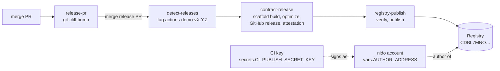

# actions-demo

Demo of the [stellar-registry/actions](https://github.com/stellar-registry/actions)
release pipeline on testnet. Merge the release PR and CI tags, builds, attests
and publishes the contract to the Registry.

The publish is signed by a CI key that can only call `publish`, on one
registry, for one wasm name. You set that key up with a
[nido](https://nido.fyi) smart account from the dapp in this repo:
https://stellar-registry.github.io/actions-demo/

This is the deliverable for SCF milestone
[D11: Registry GH workflow to publish wasms and upgrade contracts](https://scf-public-goods-maintenance.github.io/projects/stellar-registry/#d11-registry-gh-workflow-to-publish-wasms-and-upgrade-contracts).

## D11 checklist

| Milestone ask | Where |
| --- | --- |
| Wrap the stellar-expert soroban build workflow | [`release.yml`](.github/workflows/release.yml) calls `contract-release.yml`, our version of `stellar-expert/soroban-build-workflow`: GitHub release, stellar.expert validation, build provenance. |
| Build with `stellar scaffold build` | `contract-release.yml` runs `stellar scaffold build` then `stellar contract optimize`. `cargo_inherit` puts the crate version in the wasm as `binver`. |
| Publish new versions of already-published wasms | `registry-publish.yml` checks the attestation and `binver`, then calls `publish`. [Run 1](https://github.com/stellar-registry/actions-demo/actions/runs/36362820785) published 0.1.0 and claimed the name, [run 2](https://github.com/stellar-registry/actions-demo/actions/runs/36362983847) published 0.1.1 (both via upload + `publish_hash`), [run 3](https://github.com/stellar-registry/actions-demo/actions/runs/36366464508) published 0.1.2 with a single `publish` ([actions#15](https://github.com/stellar-registry/actions/pull/15)). |
| Keys that can only invoke `publish`, live in a workflow, and carry no risky privileges | A signer on a nido account, scoped by policy to `publish` on one registry for listed names with the account as author. See [Security model](#security-model). ML-DSA works on testnet but the workflow can't sign with it yet ([actions#14](https://github.com/stellar-registry/actions/issues/14)). |
| Documented, tested in production | This README and the [testnet evidence](#testnet-evidence). |
| Contract upgrades | Deferred by the milestone. |

## How it works



All four jobs are reusable workflows from stellar-registry/actions, used at
`@main`.

Every push to `main` runs `release-pr`, which keeps a single `chore: release`
PR open with the next version and changelog (git-cliff, conventional commits).
Merging that PR is how you release. `release-gate` asks the GitHub API which PR
a commit came from, and only lets `detect-releases` run when it's `release/next`.
Any other push, including a hand-edited version bump, publishes nothing.

The first version is the exception: there's no tag for git-cliff to bump from,
so run the Release workflow by hand on `main`.

Build and publish run in the same workflow via `needs:` rather than on the tag
push, since tags pushed with `GITHUB_TOKEN` don't trigger workflows. No GitHub
App needed.

### Signing and fees

`registry-publish.yml` calls `registry.publish(name, author, wasm, version)`.
The registry uploads the wasm and calls `author.require_auth()`, where the
author is the nido account.

The `theahaco/stellar-cli` fork finds the account rule that lists the CI key
and signs the auth entry as an OZ `AuthPayload` with one
`External(ed25519 verifier, public key)` signer. The wasm bytes are part of
that entry, so the signature covers the code. On-chain, `__check_auth` checks
the signature with perch's ed25519 verifier (`CA4G72A6…`) and the perch policy
on the rule checks the call. The CI key's own G account is the transaction
source and pays the fee.

So it's one normal Stellar keypair: it pays fees from its own (friendbot) XLM
and signs for the smart account only under its one rule.

The wasm ends up in the transaction twice (argument and auth entry) and
transactions max out at 132096 bytes. Anything over 60 KiB
(`publish_max_wasm_bytes`) is uploaded separately and then bound with
`publish_hash`. The demo contract is ~1 KB.

Why `External` and not `Delegated(G…)`: nido uses upstream OZ
`stellar-accounts`, where `Delegated` calls `require_auth_for_args` and needs
its own auth entry. The fork signs `Delegated` as a CAP-71
`AddressWithDelegates` credential, which only perch's patched OZ accepts. On
testnet `Delegated` fails with `Error(Auth, InvalidAction)`; `External`
[works](https://stellar.expert/explorer/testnet/tx/04d09ec04eb9b32cd5b45b9978f20651ea94689758f8933ae66a2b3e1d8e4958).

### The policy document

nido account policies are [perch](https://github.com/stellar-registry/perch)
PolicyDocs, set with `apply_doc`. The account compiles the doc through perch,
swaps in the new rules, and stores the JSON and its hash on-chain.

The dapp reads the current doc (or nido's default for a new account), adds the
key and a rule, and sends `apply_doc` to nido for the passkey to sign. This is
what's on testnet right now, keys shortened (`get_applied_doc`, hash
`3ba2021c…`):

```json
{
  "version": 1,
  "network": "Test SDF Network ; September 2015",
  "signers": [
    { "id": "admin", "verifier": "CACVGSAHYFBXY4LJKWW5B57LAAXHCZVDZOANUTYPLNV6HHQI4Q35EGMY", "key": "04aef679…a68930" },
    { "id": "ci-publish", "verifier": "CA4G72A6XEIYPORY7UKZB3WFRJYX564UAQB5I7ASZMEAEST7PRHT4PSF", "key": "eb313e74…5eb30c" }
  ],
  "rules": [
    { "name": "admin", "scope": { "type": "self-admin" }, "principals": { "type": "all", "signers": ["admin"] } },
    {
      "name": "ci-publish",
      "scope": { "type": "contract", "address": "CDBL7MNO7UI5OAAIC67UIWKQ4P3S6RVQSFCQXUHUW6TOFCXSYRPNHY4S" },
      "principals": { "type": "all", "signers": ["ci-publish"] },
      "functions": ["publish"],
      "args": [
        { "index": 0, "pred": { "type": "string-in", "values": ["actions-demo"] } },
        { "index": 1, "pred": { "type": "is-self" } }
      ]
    }
  ]
}
```

`publish_hash` is only added if you tick "Also allow publish_hash" in the dapp,
which you only need for wasms over 60 KiB.

## Security model

The key can sign `publish` on one registry, for names in the allow-list, with
the nido account as author. It can also spend its own XLM on fees. That's it.

You can check this against the live key with
[`app/scripts/check-key-scope.mjs`](app/scripts/check-key-scope.mjs). It runs
enforce-mode simulations and submits nothing:

```text
key GDVTCPTUVX5I2JBAF5CZH76UC7PQLRZVSSBBRTEE3IOV5HLLL2ZQYRWY holds rule #10 "ci-publish" on CD2BVQMPYCMNAWYFSFD234HEKJB6EH74EQWPRNVP3MVSKALH3ORS7MWM

publish, allowed name, author = account (expected: AUTHORIZED)
  -> AUTHORIZED
publish, another name
  -> refused: Error(Auth, InvalidAction)
publish_hash (authorized only if the rule opted in for wasms over 60 KiB)
  -> refused: Error(Auth, InvalidAction)
XLM transfer out of the account
  -> refused: Error(Auth, InvalidAction)
apply_doc (rewrite the account policy)
  -> refused: Error(Auth, InvalidAction)
```

Also:

- The rule is scoped to the registry contract, so the key has no rule for any
  other contract.
- No self-admin scope, so it can't change the account's signers or policy.
- It can't call `preauthorize_author_transfer` to hand the name to someone
  else. (On this registry deployment that call hits a storage error in
  simulation before auth, so the script can't test it.)
- `publish` doesn't deploy anything, so it gives no control over existing
  contracts.

If the secret leaks, someone can publish versions of the listed names with code
you didn't build, and burn version numbers since the registry only takes higher
versions. Those versions won't have a GitHub release or build attestation,
which is how anyone checking provenance can spot them. To recover, run the
dapp again to rotate: `apply_doc` replaces the whole doc, so the old key is
gone in the same transaction. (We rotated this repo's key four times.) To
revoke without replacing, delete the `ci-publish` rule on nido's policy page.

Things we're trusting:

- GitHub secrets for `CI_PUBLISH_SECRET_KEY`. The publish job only gets it
  through `STELLAR_ACCOUNT`/`STELLAR_SIGN_WITH_KEY`, never argv.
- stellar-registry/actions `main`: changes there run on the next release here.
  `registry-publish.yml` also installs the `theahaco/stellar-cli` fork by
  version tag with no checksum, which needs fixing upstream.
- perch's doc-compiler and interpreter, which are pinned by hash in the nido
  account wasm. The ed25519 verifier is resolved by name (`unverified` →
  `perch` → `perch-ed25519-verifier`); the dapp shows the address it got.
- Testnet's `unverified` registry is unmanaged. On a managed registry the
  manager approves the first publish of a name.

## Walkthrough

Screenshots from the testnet run below, secret redacted.

**1. Registry.** Enter the registry and the wasm names the key may publish.
Only tick `publish_hash` for wasms over 60 KiB. The page looks up the
registry manager, current versions, and perch's ed25519 verifier.


**2. Connect nido.** The `nido.fyi/connect/` popup returns your smart account.
The page loads its policy doc. On a fresh account it warns that the first
`apply_doc` replaces the starting rule.


**3. Generate the key.** An ed25519 keypair is made in the browser and funded
by friendbot (it pays the fees). The secret is shown once; tick the box and
it's cleared.


**4. Review and apply.** A diff of the policy doc. This screenshot is a
rotation that also switched the rule from `publish_hash` to `publish`.
"Approve in nido" simulates `apply_doc`, then opens nido's `/sign/` page where
the passkey signs and nido's relayer submits.


**5. Wire up GitHub.** The rule as read back from chain, plus the variables
and secret to add to your repo.


## Testnet evidence

| What | Link |
| --- | --- |
| Dapp (GitHub Pages) | https://stellar-registry.github.io/actions-demo/ |
| nido author account | [`CD2BVQMPYCMNAWYFSFD234HEKJB6EH74EQWPRNVP3MVSKALH3ORS7MWM`](https://stellar.expert/explorer/testnet/contract/CD2BVQMPYCMNAWYFSFD234HEKJB6EH74EQWPRNVP3MVSKALH3ORS7MWM) |
| First `apply_doc` (adds `ci-publish`, local build of the dapp) | [`58ce402c…`](https://stellar.expert/explorer/testnet/tx/58ce402c190a3805a2e87b5beb022594f10a734800608b7ca62479fc1de5d019) |
| Rotation from the live page (key used by the CI runs) | [`cdc673e5…`](https://stellar.expert/explorer/testnet/tx/cdc673e550ab39a671fef36a53f7a993d5ad4eb2b61e406def6b97611384b983) |
| Later rotations from the live page (screenshot runs) | [`d2bac458…`](https://stellar.expert/explorer/testnet/tx/d2bac4580dde98a6f6c3a39b385a216abddcb707c9bd93c98b99608dfc6534f3), [`cd19503a…`](https://stellar.expert/explorer/testnet/tx/cd19503a23ea621bc0ff6fef352034b03c9bb455a349493e2003c98efe2fbce2) |
| Rule moved to `publish`-only, new key (current state) | [`0c4e880e…`](https://stellar.expert/explorer/testnet/tx/0c4e880e6cc4f04789fff511429f0e22fec569b340cf7679819b14d3880902f6) |
| Release run 1: 0.1.0, claims the name | [run](https://github.com/stellar-registry/actions-demo/actions/runs/36362820785), [release](https://github.com/stellar-registry/actions-demo/releases/tag/actions-demo-v0.1.0), upload [`749f0319…`](https://stellar.expert/explorer/testnet/tx/749f031969e240b10001bc7e9cef983ebd60bd5507594f3e3782a895d12a8ef9), `publish_hash` [`1bf5bb7a…`](https://stellar.expert/explorer/testnet/tx/1bf5bb7a936c3bbe06ca1a3c5b7e23307a2d6efac92cc39913450c7eb8450055), wasm `711445f3…` |
| Release run 2: 0.1.1, a new version of the published wasm | [run](https://github.com/stellar-registry/actions-demo/actions/runs/36362983847), [release](https://github.com/stellar-registry/actions-demo/releases/tag/actions-demo-v0.1.1), upload [`0b7c7735…`](https://stellar.expert/explorer/testnet/tx/0b7c77358239a2582c483390123b473c757220acd8ce92f4607c2e88aa3a908b), `publish_hash` [`ae473fa9…`](https://stellar.expert/explorer/testnet/tx/ae473fa904b6edb45b8c48b3420a2bd2e81dfc58fe4891477a5c18119b4b3ef5), wasm `f71d573b…` |
| Release run 3: 0.1.2, one `publish` transaction | [run](https://github.com/stellar-registry/actions-demo/actions/runs/36366464508), [release](https://github.com/stellar-registry/actions-demo/releases/tag/actions-demo-v0.1.2), `publish` [`58ec8b59…`](https://stellar.expert/explorer/testnet/tx/58ec8b5907d4cc5a136e62c52bad1910e794fcfbac798271ddf100893eeda3f7), wasm `280a3a18…`, receipt `"method": "publish"` |

These runs came from the PR branch before merge, with versions bumped by hand.
To make that possible the release and Pages workflows temporarily ran on the
branch (and for run 3 the release gate let it through); that was reverted
before review. On `main` only a release PR merge or a manual run publishes.
Each release has the attested wasm and the `publish-receipt.json` from
`registry-publish.yml`.

Check the registry yourself:

```sh
stellar contract invoke --network testnet --send=no \
  --id CDBL7MNO7UI5OAAIC67UIWKQ4P3S6RVQSFCQXUHUW6TOFCXSYRPNHY4S \
  -- current_version --wasm_name actions-demo
```

## Using it in your repo

1. One crate per contract at `crates/<name>/Cargo.toml`, with a version and
   `[package.metadata.stellar] cargo_inherit = true`. Add a `cliff.toml` at the
   root for `release-pr`. The registry name is the crate name.
2. Open the dapp, enter your registry and wasm names, connect nido, generate
   the key, save the secret, approve the policy update.
3. Add these to the repo:

   | Name | Kind | Value |
   | --- | --- | --- |
   | `REGISTRY_CONTRACT_ID` | variable | the registry (C…) |
   | `AUTHOR_ADDRESS` | variable | your nido account (C…) |
   | `CI_PUBLISH_SECRET_KEY` | secret | the key from the dapp (S…) |

   Allow Actions to create pull requests (Settings → Actions → General), and
   set Pages to deploy from GitHub Actions if you want `pages.yml`.
4. Merge the contract at its starting version, then run Release by hand on
   `main` with `publish_tag` empty. On an unmanaged registry this claims the
   name. On a managed one, have the manager publish the first version with
   your account as author.
5. After that, just merge to `main` and merge the `chore: release` PR when you
   want to ship. If a publish fails, rerun the workflow with `publish_tag` set
   to the existing release.

Use merge commits, not squash, so release tags stay reachable from `main` for
git-cliff.

## Development

```sh
cargo test                       # contract
cd app && npm ci
npm run dev                      # http://localhost:4321/actions-demo/
npm test && npm run check        # policy-doc tests, astro check
npm run check-key                # needs CI_PUBLISH_SECRET_KEY, AUTHOR_ADDRESS, REGISTRY_CONTRACT_ID
```

The dapp is Astro using nido's Warm Nest design tokens. It uses
`@stellar-registry/perch` for the policy doc (canonical JSON, hash, schema)
and talks to nido's popup protocol directly, because the published
`@nidohq/stellar-wallets-kit-module` 0.1.0 doesn't handle the `nido_submitted`
result yet and `@nidohq/passkey-sdk` 0.1.0 doesn't have the policy-doc layer.

## nido quirks

- `/sign/` shows `apply_doc` as a raw transaction, not a doc diff, which is why
  the dapp shows the diff first.
- A new nido account might not show up in `nido.fyi/connect/` until you've
  opened `nido.fyi` once on that device.
- The first `apply_doc` replaces the account's constructor rule (true of any
  nido doc flow). The passkey keeps admin through the doc's `admin` rule.

## TODO

- ML-DSA (post-quantum) publish keys,
  [actions#14](https://github.com/stellar-registry/actions/issues/14). Already
  proven on testnet (`apply_doc` plus an ML-DSA-signed `publish`, other calls
  refused), but the stellar-cli fork only signs Ed25519, `registry-publish.yml`
  needs a separate fee-payer input since ML-DSA keys have no classic account,
  and the verifier is still in unmerged nido PRs
  ([#144](https://github.com/nidohq/nido/pull/144),
  [#146](https://github.com/nidohq/nido/pull/146)).
- Contract upgrades through the registry (deferred by the milestone).
